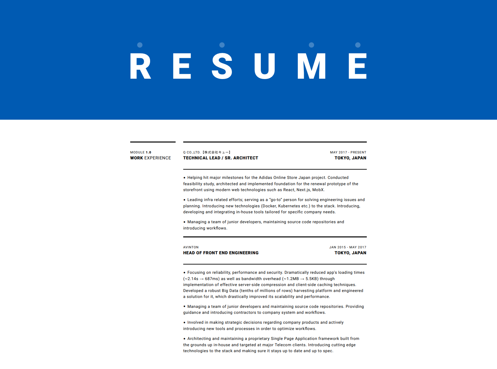

[](https://brtstk.github.io/resume)

---

<p align="center">
  <strong>
    Demo: <a href="https://brtstk.github.io/resume">🕹 https://brtstk.github.io/resume</a>
  </strong>
</p>

---

# Usage

## npm Mode

```
$ npm i -g rsme

// initialize an example résumé
// option: dir param to init inside a directory
$ rsme init [dir]

// start a local development server
$ rsme start

// build HTML + PDF
$ rsme build

// run preview HTML + PDF
// option: preview only PDF
$ rsme preview [pdf]

// display help
$ rsme --help
```

## Repo Mode
```
$ git clone git@github.com:brtstk/resume.git
$ cd resume
$ npm i

// start a local development server
$ npm run start

// build HTML + PDF
$ npm run build

// run preview HTML + PDF
$ npm run preview

// run preview PDF
$ npm run preview:pdf
```
